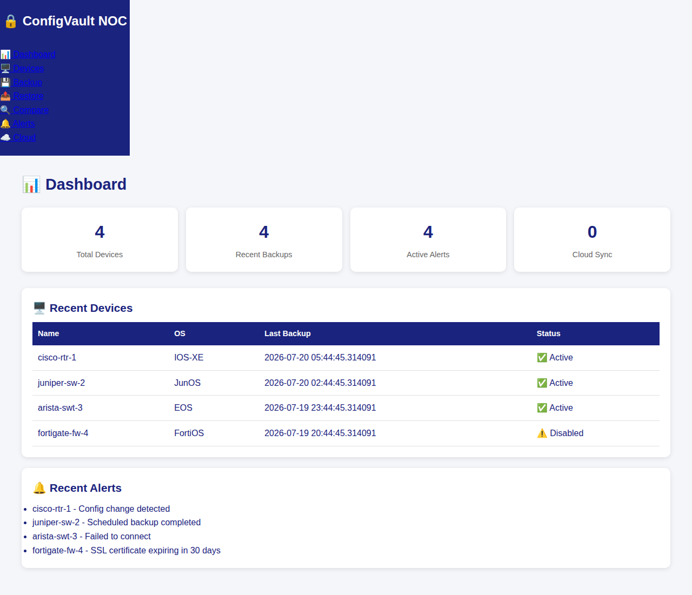

# 🔧 ConfigVault

### Network configuration backup & asset management dashboard

ConfigVault is a Flask-based NOC dashboard and REST API for tracking network devices,
recording configuration backups, comparing config versions, and surfacing backup/alert activity.
It stores inventory and backup metadata in SQLite (configurable to any SQLAlchemy-supported DB)
and exposes a token-authenticated `v1` API alongside a web UI.



## ✨ Features

- **Device Inventory** — register network devices (routers, switches, firewalls, APs) with host, OS type, protocol, and credentials.
- **Backup Triggers** — start a backup run for a device and record version, config path, size, and status.
- **Backup History & Schedules** — browse past backups and view daily/weekly/monthly schedule definitions.
- **Config Compare** — diff two backup versions and summarize added/removed/changed lines via the API.
- **Restore** — restore a device configuration from a known backup version.
- **Alerts** — create and track alerts with severity levels (info/warning/critical) and resolution state.
- **Cloud Sync (rclone)** — trigger an `rclone sync` to S3 / Google Drive / OneDrive / B2 / Dropbox when enabled.
- **REST API** — token-authenticated `v1` API covering devices, backups, restore, compare, alerts, and sync.

> Status: the web UI and API are functional for inventory, backup tracking, compare, restore, and alerts.
> Live device connections (SSH/FTP/SFTP/TFTP/Oxidized) and actual config file transfer are stubbed —
> the app records backup *metadata* rather than pulling running configs from devices yet.

## 🚀 Quick Start

### Docker (recommended)

```bash
git clone https://github.com/OneByJorah/ConfigVault.git
cd ConfigVault
docker build -t configvault .
docker run -d -p 5001:5000 \
  -e SECRET_KEY="$(openssl rand -hex 32)" \
  -v "$(pwd)/instance:/app/instance" \
  --name configvault configvault
# open http://localhost:5001
# populate demo data:
docker exec configvault python -m flask seed
```

### Manual / from source

```bash
git clone https://github.com/OneByJorah/ConfigVault.git
cd ConfigVault
python3 -m venv venv && source venv/bin/activate
pip install -r requirements.txt
cp .env.example .env   # set a strong SECRET_KEY
export SECRET_KEY="$(openssl rand -hex 32)"
python -m flask seed   # optional demo data
python app.py          # serves http://localhost:5000
```

## 📸 Screenshots

- **[Dashboard](docs/screenshots/main-dashboard.png)** — device/backup/alert stats and recent activity.
- **[Devices](docs/screenshots/devices.png)** — device inventory table and add-device form.
- **[Backup](docs/screenshots/backup.png)** — backup trigger, history, and schedules.
- **[Alerts](docs/screenshots/alerts.png)** — alert timeline with severity and resolution state.

## 🏗️ Architecture / How It Works

```
ConfigVault/
├── app/
│   ├── __init__.py        # App factory, config loading, URL rules
│   ├── config.py          # Transport/integration settings (env-driven)
│   ├── models.py          # SQLAlchemy models: Device, Backup, Commit, DeviceCommit, Alert
│   ├── seed.py            # Demo-data seed command (flask seed)
│   └── routes/
│       ├── api.py         # Health + config endpoints
│       ├── devices.py     # Device CRUD + per-device backup
│       ├── backup.py      # Backup trigger + schedules
│       ├── restore.py     # Restore from a backup version
│       ├── compare.py     # Config diff
│       ├── alerts.py      # Alert CRUD + resolution
│       ├── sync.py        # rclone cloud sync trigger
│       └── web.py         # HTML dashboard pages
├── templates/             # Jinja2 UI (rendered with live DB data)
├── static/                # CSS assets
├── config/default.conf    # YAML defaults (overridable by env vars)
└── requirements.txt
```

The Flask app factory loads `config/default.conf` for defaults, then overrides
`SECRET_KEY` and `DATABASE_URL` from the environment. The web UI and API share the
same SQLite database under the Flask instance folder (`instance/configvault.db`).

## ⚙️ Configuration

| Variable | Default | Description |
|----------|---------|-------------|
| `SECRET_KEY` | `dev-secret-key` | Bearer token for API auth. **Set a strong random value.** |
| `DATABASE_URL` | `sqlite:///configvault.db` | SQLAlchemy DB URI. |
| `FTP_ENABLED` / `SFTP_ENABLED` / `TFTP_ENABLED` | `true` | Transport toggles. |
| `OXIDIZED_ENABLED` / `GIT_ENABLED` | `true` | Integration toggles. |
| `CLOUD_SYNC` | `false` | Enable rclone cloud sync endpoint. |
| `CONFIGVAULT_PORT` | `5000` | Port the dev server binds to. |

YAML defaults in `config/default.conf` can also set these; environment variables take precedence.

## 🧪 Testing

```bash
source venv/bin/activate
pip install -r requirements.txt
export SECRET_KEY=test-secret-key
pytest tests/ -q
```

A smoke suite under `tests/` verifies the health endpoint, that every web page renders,
API auth enforcement, and that a backup creates a record.

## 🗺️ Roadmap

- Live device config pull over SSH/SFTP (paramiko) instead of recording only metadata.
- Real diff rendering in the Compare UI from stored backup files.
- Oxidized/Git integration for versioned config history.

## 🤝 Contributing

Fork, branch, and open a PR. Keep `SECRET_KEY`/credentials out of committed files — use `.env`
(already git-ignored) and `.env.example` for templates. Run `pytest` before submitting.

## 📄 License

MIT — see [LICENSE](LICENSE)

## 👤 Author

Built by **Jhonattan L. Jimenez** ([@OneByJorah](https://github.com/OneByJorah)) under **JorahOne LLC**.
More projects: [github.com/OneByJorah](https://github.com/OneByJorah)
