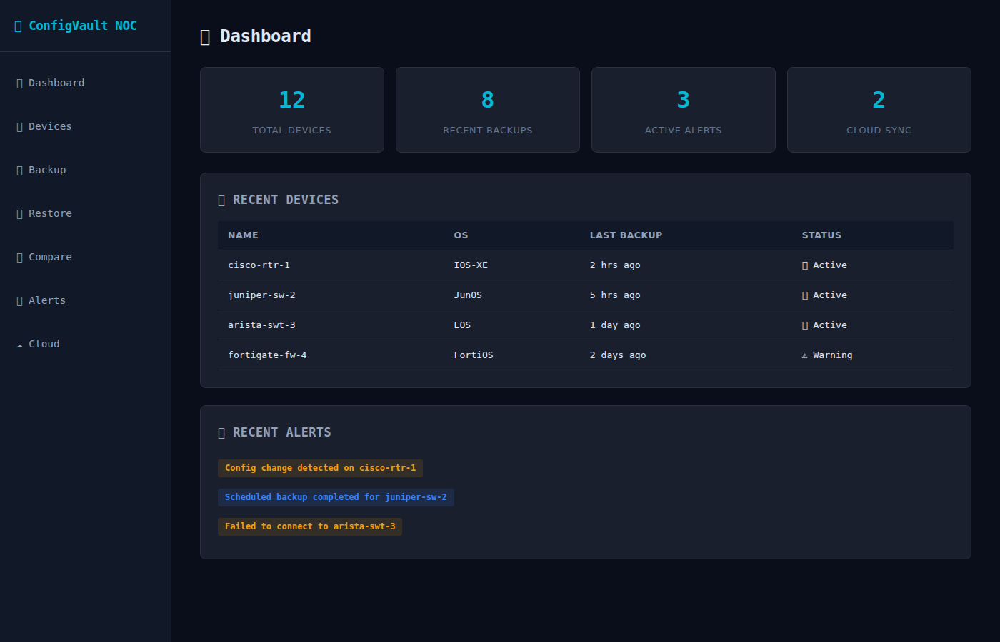
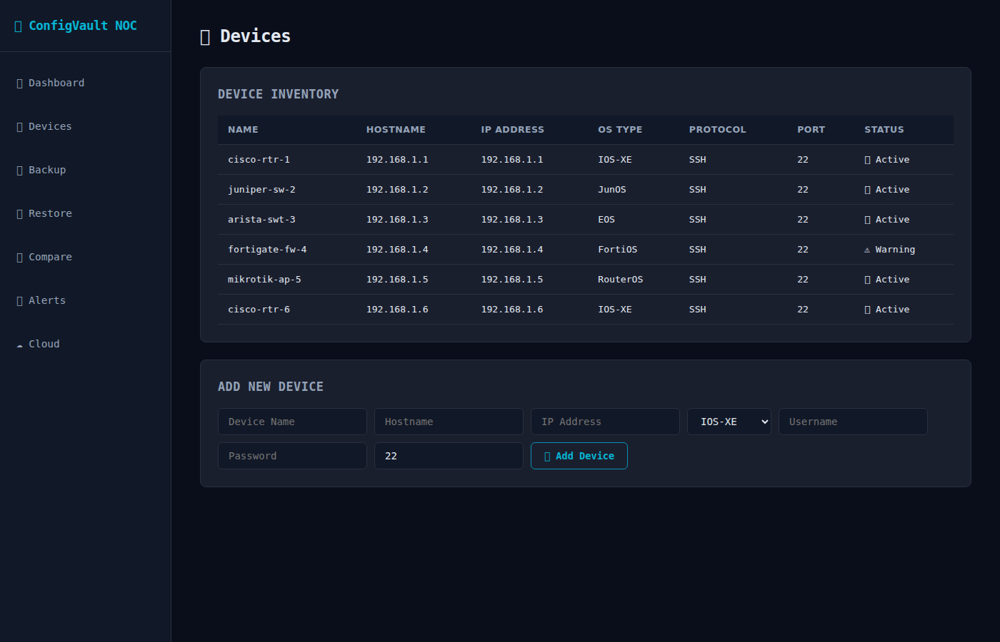
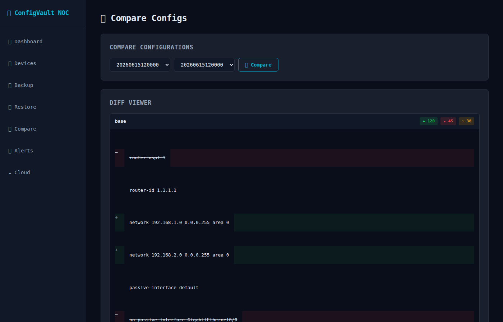

<div align="center">


# ConfigVault

**The self-hosted network configuration backup and asset manager for small NOC teams — inventory devices, schedule backups, diff snapshots, and sync to cloud storage.**

<a href="https://github.com/OneByJorah/ConfigVault/stargazers"></a>
<a href="https://github.com/OneByJorah/ConfigVault/commits"></a>


</div>


## What This Is

ConfigVault gives small network teams a lightweight, self-hosted alternative to heavyweight NMS suites for one job done well: keeping router, switch, firewall, and AP configurations backed up and auditable. It inventories devices, runs config backups over SSH/SFTP (Paramiko), stores every snapshot with a checksum, and shows side-by-side diffs between versions.

Everything runs from a single Flask process with SQLite by default — no database server, no cloud lock-in, and optional rclone sync to S3, Google Drive, OneDrive, B2, or Dropbox.

## Quick Start

```bash
git clone https://github.com/OneByJorah/ConfigVault.git
cd ConfigVault
cp .env.example .env      # set SECRET_KEY (and DATABASE_URL for Postgres)
docker compose up -d
```

Open **http://localhost:8103**.

> [!NOTE]
> `docker compose` mounts `./instance` for the SQLite DB and `./configs` for git-backed history. To run without Docker, use `./install.sh` then `python app.py`.

## Features

- **Device inventory** — track routers, switches, firewalls, and APs with hostname, IP, OS type, protocol, and port.
- **Scheduled & on-demand backups** — trigger backups per device or list/create schedules through the API; history is git-backed.
- **Snapshot diff** — compare any two config versions to see added, removed, and changed lines.
- **Config restore** — roll a device back to a historical backup commit.
- **Alert engine** — Slack, Microsoft Teams, Discord, and email webhook notifications.
- **Optional cloud sync** — rclone integration for S3, Google Drive, OneDrive, B2, and Dropbox (off by default).
- **Protocol integrations** — FTP, SFTP, TFTP, and Oxidized hooks (all disabled by default for safer deployments).
- **Dark NOC UI** — Jinja2 templates with a responsive dashboard for devices, backups, restores, compares, alerts, and cloud sync.

## Architecture

```
┌─────────────┐     HTTP      ┌──────────────────┐     ┌──────────────┐
│   Browser   │ ──────────▶   │  Flask NOC UI    │────▶│  SQLAlchemy  │
│  (Dark UX)  │ ◀──────────── │  Port 8103       │◀────│  SQLite/PG   │
└─────────────┘               └──────────────────┘     └──────────────┘
                                       │
                     ┌─────────────────┼─────────────────┐
                     ▼                 ▼                 ▼
             ┌──────────────┐  ┌──────────────┐  ┌──────────────┐
             │   Paramiko   │  │    rclone    │  │ Alert Engine │
             │   SSH/SFTP   │  │  Cloud Sync  │  │ Webhooks     │
             └──────┬───────┘  └──────┬───────┘  └──────────────┘
                    ▼                 ▼
             ┌──────────────┐  ┌──────────────┐
             │   Network    │  │  S3 / GDrive │
             │   Devices    │  │  / B2 / O365 │
             └──────────────┘  └──────────────┘
```

## Configuration

ConfigVault reads environment variables first, then falls back to `config/default.conf`.

| Variable | Default | Description |
|----------|---------|-------------|
| `DATABASE_URL` | `sqlite:///instance/configvault.db` | SQLAlchemy database URI |
| `SERVER_NAME` | `configvault.local` | Server hostname |
| `SECRET_KEY` | `dev-secret-key` | Flask secret + API bearer token — **change this** |
| `FTP_ENABLED` | `false` | Enable FTP backup target |
| `SFTP_ENABLED` | `false` | Enable SFTP backup target |
| `TFTP_ENABLED` | `false` | Enable TFTP backup target |
| `OXIDIZED_ENABLED` | `false` | Enable Oxidized integration |
| `GIT_ENABLED` | `true` | Git-backed config history |
| `CLOUD_SYNC` | `false` | Enable rclone cloud sync |
| `SLACK_WEBHOOK` / `TEAMS_WEBHOOK` / `DISCORD_WEBHOOK` | — | Notification webhooks |
| `EMAIL_ENABLED` / `EMAIL_SERVER` | `false` / — | Email notification settings |

> [!WARNING]
> Write endpoints are protected by a shared bearer token equal to `SECRET_KEY`. Set a strong value and never commit real credentials to git.

## API Endpoints

All routes are prefix `/api/v1`. Write operations require an `Authorization: Bearer <SECRET_KEY>` header.

| Endpoint | Method | Description |
|----------|--------|-------------|
| `/health` | GET | Health check |
| `/config` | GET | App configuration summary |
| `/devices` | GET/POST | List / add devices |
| `/devices/{id}` | GET/PUT/DELETE | Read, update, or remove a device |
| `/devices/{id}/backup` | POST | Trigger a device backup |
| `/backup` | POST | Start a backup run |
| `/backup/schedule` | GET/POST | List or create schedules |
| `/backup/schedule/{id}` | DELETE | Remove a schedule |
| `/restore` | POST | Restore a config version |
| `/restore/{commit_id}` | GET | Inspect a restore commit |
| `/compare` | POST | Diff two snapshots |
| `/alerts` | GET/POST | List or create alerts |
| `/alerts/{id}` | GET/DELETE | Read or delete an alert |
| `/sync` | POST | Push backups to cloud storage |
| `/sync/status` | GET | Cloud sync status |

## Use Cases

1. **Small NOCs** — replace ad-hoc TFTP/FTP backup scripts with a tracked, auditable inventory.
2. **MSPs** — keep per-client device configs versioned and diffable before change windows.
3. **Compliance** — retain restore points with checksums and push them off-box to cloud storage.

## Tech Stack

Python 3.11, Flask 3, Flask-SQLAlchemy, Flask-Migrate, Flask-CORS, Paramiko, PyYAML, SQLite/PostgreSQL, rclone, Docker Compose.

## Screenshots

| Dashboard | Devices | Compare |
|---|---|---|
|  |  |  |

More captures live in [`docs/screenshots/`](docs/screenshots/).

## Contributing

Contributions are welcome — see [CONTRIBUTING.md](CONTRIBUTING.md). [Open an issue](https://github.com/OneByJorah/ConfigVault/issues) to report a bug or request a feature.

## License

MIT — see [LICENSE](LICENSE).

## Connect

- [jorahone.com](https://jorahone.com)
- [GitHub Org](https://github.com/OneByJorah)
- [info@jorahone.com](mailto:info@jorahone.com)
