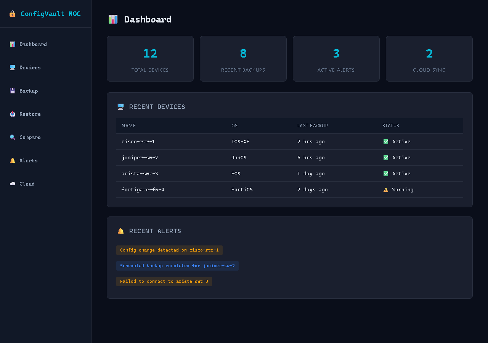

# ConfigVault

> Self-hosted network config backup and asset manager for small NOCs — inventories devices, runs SSH/SFTP backups, diffs snapshots, and optionally syncs to cloud storage.

[](https://github.com/OneByJorah/ConfigVault)
[](https://github.com/OneByJorah/ConfigVault)
[](https://github.com/OneByJorah/ConfigVault/stargazers)
[](https://github.com/OneByJorah/ConfigVault/commits)
[](https://github.com/OneByJorah/ConfigVault/actions/workflows/ci.yml)



## What This Is

ConfigVault gives small network teams a lightweight, self-hosted alternative to heavyweight NMS suites for one job done well: keeping router, switch, firewall, and AP configurations backed up and auditable. It inventories devices, runs config backups over SSH/SFTP via Paramiko, stores every snapshot with a checksum in git-backed history, and shows side-by-side diffs between versions. One Flask process and SQLite are all you need; rclone sync to S3, Google Drive, OneDrive, B2, or Dropbox is opt-in.

## Quick Start

```bash
git clone https://github.com/OneByJorah/ConfigVault.git
cd ConfigVault
cp .env.example .env      # set SECRET_KEY
docker compose up -d
```

Open **http://localhost:8103**. Without Docker: `./install.sh` then `python app.py`.

## Features

- Device inventory for routers, switches, firewalls, and APs with hostname, IP, OS type, protocol, and port.
- On-demand and scheduled backups per device; git-backed history with checksums.
- Snapshot diff between any two versions; config restore to a historical commit.
- Alert engine with Slack, Microsoft Teams, Discord, and email webhooks.
- Optional rclone cloud sync to S3, Google Drive, OneDrive, B2, and Dropbox.
- Protocol integrations for FTP, SFTP, TFTP, and Oxidized — all disabled by default.
- Dark NOC UI covering devices, backups, restores, compares, alerts, and cloud sync.

## Architecture

```
Browser ──HTTP──▶ Flask NOC UI (:8103) ──▶ SQLite / PostgreSQL
                        │
        ┌───────────────┼───────────────┐
        ▼               ▼               ▼
    Paramiko         rclone         Alert engine
    SSH/SFTP         cloud sync     webhooks
        │               │
        ▼               ▼
   Network devices   S3 / GDrive / B2 / OneDrive / Dropbox
```

Write endpoints are protected by a bearer token equal to `SECRET_KEY` — set a strong value before exposing the app.

## Stack

Python 3.11 · Flask 3 · Flask-SQLAlchemy · Flask-Migrate · Flask-CORS · Paramiko · PyYAML · SQLite/PostgreSQL · rclone · Docker Compose.

## Contributing

See [CONTRIBUTING.md](CONTRIBUTING.md). [Open an issue](https://github.com/OneByJorah/ConfigVault/issues) to report a bug or request a feature.

## License

MIT — see [LICENSE](LICENSE).
