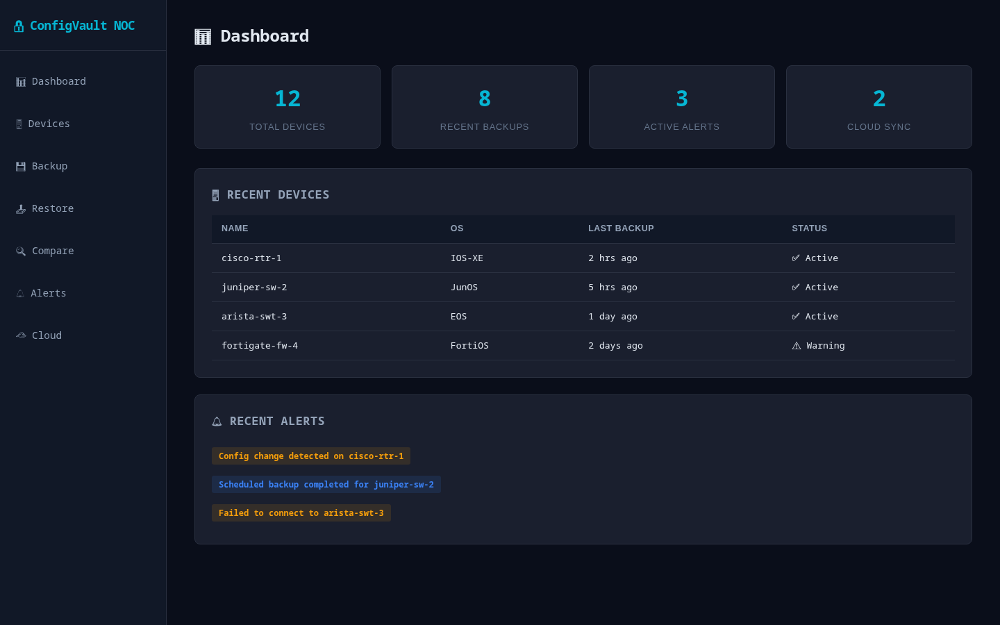

<div align="center">
  <h1>🔒 ConfigVault</h1>
  <p><strong>Network Configuration Backup & Asset Management Dashboard</strong></p>

  <p>
    
    
    
    
    
    
  </p>

  <p>
    
    
    
    
  </p>

  
</div>

---

## 📋 Features

| Feature | Description |
|---------|-------------|
| **Device Inventory** | Centralized management of routers, switches, firewalls, and APs |
| **Backup Scheduling** | Automated full/startup config backups with cron-based scheduling |
| **Snapshot Diff** | Side-by-side configuration comparison with line-level highlighting |
| **Config Restore** | One-click rollback to any historical backup snapshot |
| **Alert Engine** | Real-time notifications via Slack, Teams, Discord, and email |
| **Cloud Sync** | rclone-powered backup to S3, GDrive, OneDrive, Backblaze B2 |
| **SSH Integration** | Paramiko-based secure device connections (SSH/SFTP) |
| **NOC Dashboard** | Dark-theme web UI with live status monitoring |

## 🚀 Quick Start

```bash
git clone https://github.com/OneByJorah/ConfigVault.git
cd ConfigVault
pip install -r requirements.txt
python3 setup.py install
python3 app.py
```

Open **http://localhost:8103** in your browser.

### Docker

```bash
docker compose up -d
```

## 🏗️ Architecture

```
┌─────────────┐     HTTP      ┌──────────────────┐     ┌──────────────┐
│   Browser   │ ──────────▶   │  Flask (NOC UI)  │────▶│  SQLAlchemy  │
│  (Dark UX)  │ ◀──────────── │  Port 8103       │◀────│  SQLite/PG   │
└─────────────┘               └──────────────────┘     └──────────────┘
                                      │
                    ┌─────────────────┼─────────────────┐
                    ▼                 ▼                  ▼
            ┌──────────────┐  ┌──────────────┐  ┌──────────────┐
            │   Paramiko   │  │    rclone    │  │ Alert Engine │
            │   SSH/SFTP   │  │  Cloud Sync  │  │ Slack/Email  │
            └──────┬───────┘  └──────┬───────┘  └──────────────┘
                   │                 │
                   ▼                 ▼
            ┌──────────────┐  ┌──────────────┐
            │   Network    │  │  S3 / GDrive │
            │   Devices    │  │  / B2 / O365 │
            └──────────────┘  └──────────────┘
```

## 📁 Project Structure

```
ConfigVault/
├── app/                          # Flask application package
│   ├── __init__.py               # Application factory
│   ├── config.py                 # Environment-based configuration
│   ├── models.py                 # SQLAlchemy ORM models
│   └── routes/                   # API route blueprints
│       ├── devices.py            # Device CRUD endpoints
│       ├── backup.py             # Backup scheduling & execution
│       ├── restore.py            # Configuration restoration
│       ├── compare.py            # Snapshot diff comparison
│       ├── alerts.py             # Alert tracking & webhooks
│       ├── sync.py               # Cloud sync operations
│       └── api.py                # REST API v1 root
├── templates/                    # Jinja2 HTML templates
├── static/                       # Static assets (CSS)
├── config/                       # Configuration files
├── docs/                         # Documentation & assets
├── app.py                        # Entry point
├── setup.py                      # Package installer
├── requirements.txt              # Python dependencies
├── Dockerfile                    # Docker image
├── docker-compose.yml            # Docker Compose
└── j1.yaml                       # J1 stack definition
```

## 🔧 Configuration

ConfigVault uses environment variables and a YAML config file:

| Variable | Default | Description |
|----------|---------|-------------|
| `DATABASE_URL` | `sqlite:///configvault.db` | Database connection string |
| `SERVER_NAME` | `configvault.local` | Server hostname |
| `SECRET_KEY` | `dev-secret-key` | Flask secret key |
| `SSH_KEY_PATH` | `~/.ssh/id_rsa` | SSH key path |
| `BACKUP_RETENTION_DAYS` | `30` | Backup retention period |
| `CLOUD_SYNC` | `false` | Enable rclone cloud sync |
| `SLACK_WEBHOOK` | — | Slack webhook URL |
| `DISCORD_WEBHOOK` | — | Discord webhook URL |
| `TEAMS_WEBHOOK` | — | Microsoft Teams webhook |

## 📡 API Endpoints

| Endpoint | Method | Description |
|----------|--------|-------------|
| `/api/v1/health` | GET | Health check |
| `/api/v1/config` | GET | App configuration |
| `/api/v1/devices` | GET | List devices |
| `/api/v1/backup` | POST | Trigger backup |
| `/api/v1/backup/schedule` | GET | List schedules |
| `/api/v1/restore` | POST | Restore config |
| `/api/v1/compare` | POST | Diff snapshots |
| `/api/v1/alerts` | GET | List alerts |
| `/api/v1/sync` | POST | Push to cloud |
| `/api/v1/sync/status` | GET | Sync status |

## 🤝 Contributing

Contributions are welcome. See [CONTRIBUTING.md](CONTRIBUTING.md) for guidelines and [CODE_OF_CONDUCT.md](CODE_OF_CONDUCT.md).

## 🔒 Security

Report vulnerabilities privately to **security@jorahone.com** — see [SECURITY.md](SECURITY.md).

## 📄 License

MIT © [Jhonattan L. Jimenez](https://github.com/OneByJorah)

---

<p align="center">Built with 🌴 by <a href="https://github.com/OneByJorah">OneByJorah</a> · <a href="https://jorahone.com">jorahone.com</a></p>
